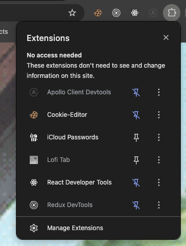
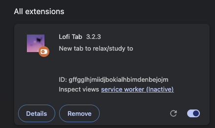

# Details

## How to run it locally

- Read the README file
- Run `pnpm i`
- Run `pnpm dev` in the root directory

## pnpm dev in root

When running `pnpn dev` in the root directory you will run at the same time:

1. A NextJS project that can be accessible at http://localhost:3000/
2. Also inside the NextJS project you will be running the LofiTab api http://localhost:3000/api/ this is used for example to get the weather
3. A React App with Vite that can be accessible at http://localhost:5173/

## Running as a Chrome Extension

To test it as a chrome extension you must:

- Make sure you are running: `pnpm dev`
- On your Chrome go to Manage Extension
  
- Click on **Load unpacked**
- Select the `dist` folder at: `apps/chrome-extension`
  
- Open a new tab
- That's it. Now you should be able to alter the extension and see it changes live

## lofitab.com

Make sure that new features are added also on the website: `apps/nextjs-website`
